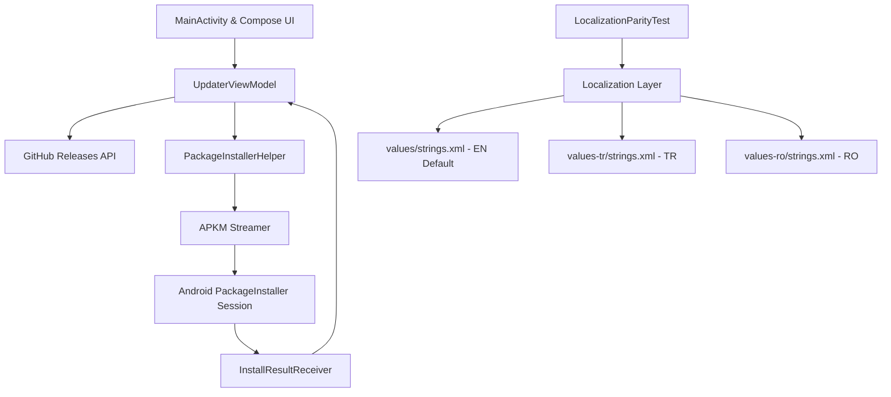

# Symbolic Memory Graph

```mermaid
graph TD
    UI[MainActivity & Compose UI] --> VM[UpdaterViewModel]
    VM --> API[GitHub Releases API]
    VM --> Helper[PackageInstallerHelper]
    Helper --> Zip[APKM Streamer]
    Zip --> System[Android PackageInstaller Session]
    System --> Receiver[InstallResultReceiver]
    Receiver --> VM
    
    Sub[Localization Layer] --> Default[values/strings.xml - EN Default]
    Sub --> TR[values-tr/strings.xml - TR]
    Sub --> RO[values-ro/strings.xml - RO]
    
    Test[LocalizationParityTest] --> Sub
```
